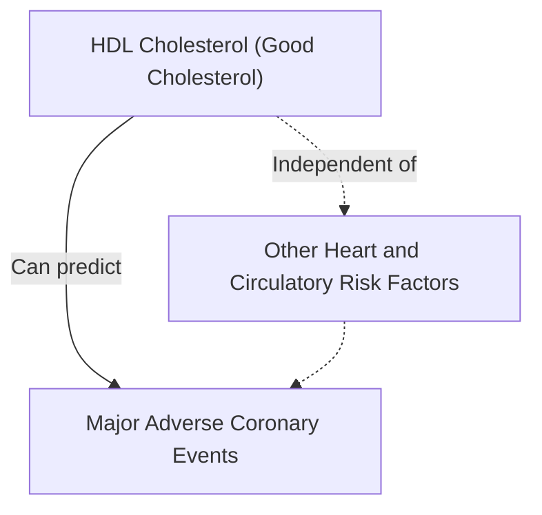
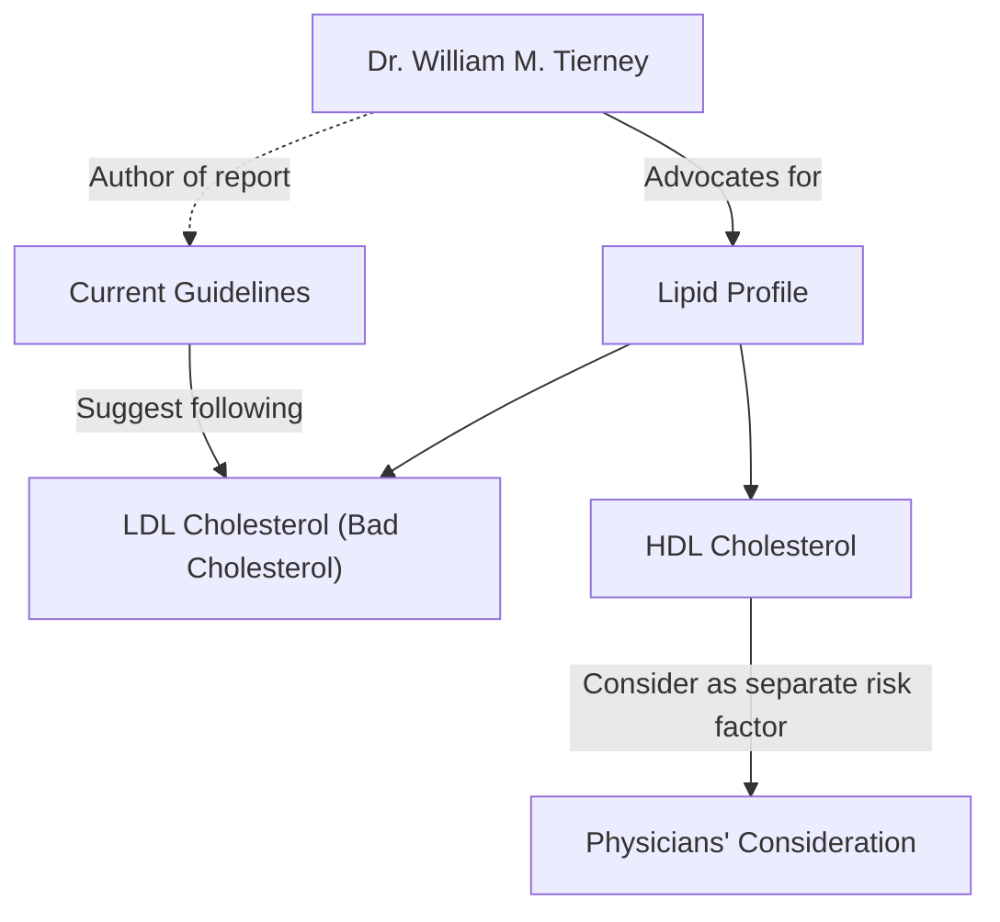
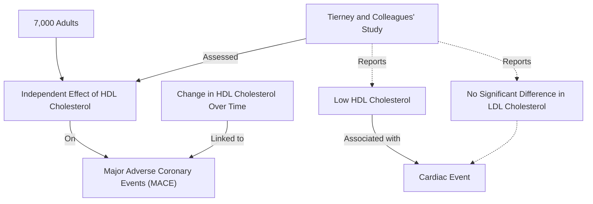
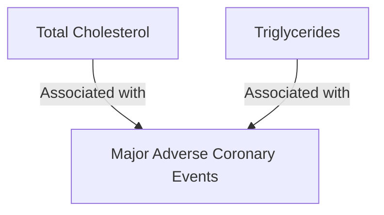
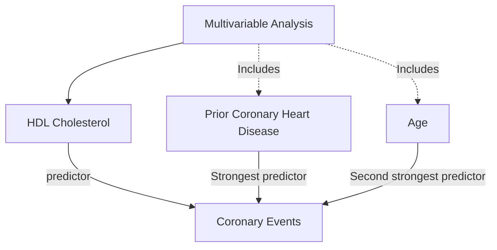
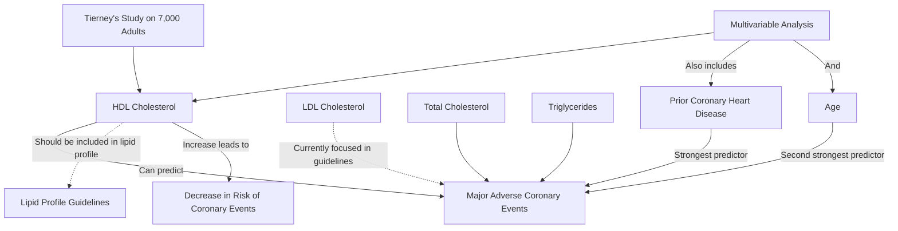

#### HDL cholesterol level predicts heart events

**Mar 27 (Reuters Health)** - Levels of HDL cholesterol—the good cholesterol—can be used to predict major adverse coronary events, independent of other heart and circulatory risk factors, according to a report published this month.

> [!info] prompt: Can you please draw me a causal relation tree of this paragraph in mermaid ?

Currently, most guidelines only suggest following the "bad" LDL cholesterol, Dr. William M. Tierney, an author of the report, told Reuters Health. "A lipid profile needs to include HDL, and physicians need to consider this as a separate risk factor and follow it," he said.

Tierney, from the Indiana University School of Medicine, Indianapolis, and colleagues assessed the independent effect in everyday clinical practice of HDL cholesterol and its change over time on the occurrence of major adverse coronary events among nearly 7,000 adults. HDL cholesterol was significantly lower for patients who subsequently experienced a cardiac event, such as a heart attack, compared with those who did not experience a cardiac event, the authors report, but there was no significant difference in LDL cholesterol values between those with and those without subsequent cardiac events.

> [!warning] All 7000 adults had about the same LDL level. This is why the study can actually not conclude anything about the usefulness of LDL Cholesterol in predicting MACEs.

Higher values for total cholesterol and triglycerides were also associated with subsequent major adverse coronary events.

In a "multivariable" analysis, HDL cholesterol was the only lipid measurement that significantly predicted coronary events, the researchers note. It was the third strongest predictor behind prior coronary heart disease and age.

>[!info] HDL predicts MACE, but only after age and prior coronary heart disease. But is it maybe simply a correlation with age? Or prior coronary heart disease?

Each 10 mg/dL increase in the baseline HDL cholesterol value was associated with an 11 percent decrease in the risk of an acute coronary event, the report indicates. Similarly, a positive change of 10 mg/dL between the two measurement times was associated with a 7 percent lower risk of subsequent major adverse coronary events.
![[fc0be6fb-b9a2-4fcd-9734-05d9387c1824.png|600]]

"We have repeated this study for the outcome of acute stroke, and found similar findings (HDL seeming to be the more important lipid fraction in predicting stroke risk)," Tierney reported.
>[!warning] If you have already a study about "acute coronary event risk", then finding that "acute stroke" behaves similar is useless. (blocking vessels in the brain is the result of the same mechanics that produce heart disease)

SOURCE: American Heart Journal March 2006.
Publish Date: March 27, 2006

If the LDL level **is about the LDL level used in the study** for all 7000 adults, then HDL is a "predictor" of Coronary Events. Or it correlates with the real factors, like Age or Prior Coronary Heart Disease.
They would have to do more studies with different LDL levels to rule out that LDL is a strong predictor of MACE.
